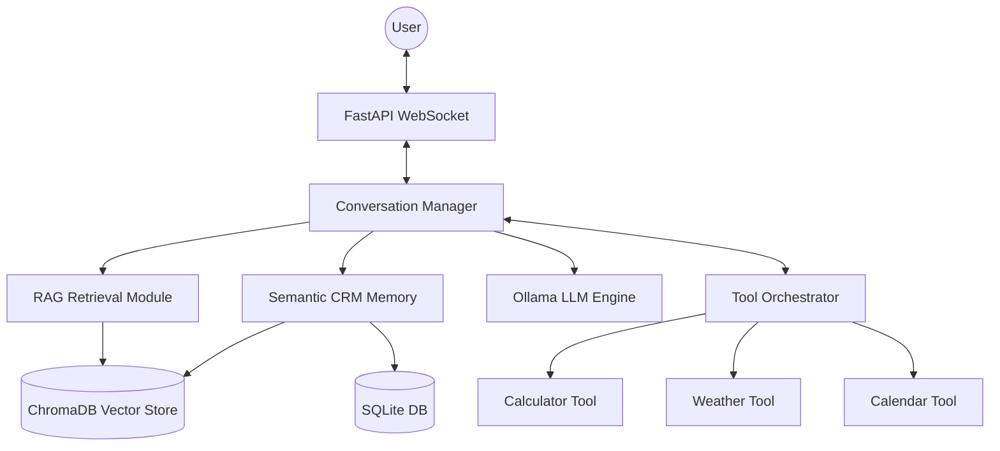

# Ali Real Estate — Autonomous Agentic Chatbot with Semantic Memory & RAG

## Group Members
*   **Name:** [Insert Name] | **ID:** [Insert ID]
*   **Name:** [Insert Name] | **ID:** [Insert ID]

## Project Overview
This project is a sophisticated evolution of a conversational AI system, extending the foundations of Assignment 3 into a fully autonomous agentic chatbot. Named **Ali**, the assistant is designed for the Pakistani real estate market, providing a seamless, real-time experience.

The system integrates:
*   **Retrieval-Augmented Generation (RAG):** Grounding responses in authorized property documents.
*   **Semantic CRM Memory:** A persistent, typo-tolerant user profile system.
*   **Autonomous Tool Orchestration:** Dynamic execution of math, weather, and scheduling tools.
*   **Real-time Streaming:** Token-by-token response delivery via WebSockets.
*   **Local LLM Engine:** Powered by Ollama for privacy and low-latency offline inference.

## Business Use Case
In the high-stakes Pakistani real estate market, customers often struggle with inconsistent pricing and information overload. **Ali** solves this by:
*   **Information Consistency:** Using RAG to ensure every price and plot size comes strictly from authorized agency PDFs.
*   **Transactional Efficiency:** Automating redundant tasks like currency conversion (math tool), site visit scheduling (calendar tool), and checking local conditions (weather tool).
*   **Personalized Experience:** Using semantic memory to remember user budgets and preferences across sessions, even if the user provides slightly different wording or typos.

## Complete System Architecture

### Architectural Workflow
The system follows a modular, asynchronous architecture designed for high concurrency and low latency.



### Component Breakdown
*   **Frontend:** Vanilla HTML/JS with WebSocket integration for real-time streaming.
*   **FastAPI Backend:** Handles WebSocket connections and session lifecycle.
*   **Conversation Manager:** The central "brain" that manages history, context window trimming, and iterative tool-calling loops.
*   **Tool Orchestrator:** Parses JSON tool calls from LLM output and executes registered async functions.
*   **RAG Module:** Uses `SentenceTransformers` and `ChromaDB` for high-speed document retrieval.
*   **Semantic CRM:** Combines SQLite for persistence with ChromaDB for semantic key matching.

## Workflow Explanation

### User Request Lifecycle
1.  **Ingress:** User sends a message via the frontend WebSocket.
2.  **Preprocessing:** The Conversation Manager retrieves the user's CRM profile and detects off-topic intent.
3.  **RAG Retrieval:** The system embeds the query and fetches the top-3 relevant context chunks from ChromaDB.
4.  **Prompt Assembly:** A dynamic system prompt is built, including identity, inventory, conversation state, RAG context, and tool documentation.
5.  **Iterative Inference:**
    *   The LLM streams tokens. If it generates a JSON tool call, the stream is intercepted.
    *   The **Tool Orchestrator** executes the tool asynchronously.
    *   The result is appended to the context, and the LLM is asked for a final, natural response.
6.  **Streaming Delivery:** Final tokens are streamed back to the user via WebSockets.

## RAG Implementation
The RAG pipeline ensures the chatbot is grounded in factual data.
*   **Pipeline:** `backend/RAG/indexer.py` (Ingestion) $\rightarrow$ `backend/RAG/retrieval.py` (Query).
*   **Chunking:** 512-character chunks with a 50-character overlap.
*   **Embedding Model:** `all-MiniLM-L6-v2` (MiniLM) for a perfect balance of speed and accuracy.
*   **Vector DB:** ChromaDB (Persistent).
*   **Retrieval:** Top-3 chunks retrieved using Cosine Similarity.
*   **Optimization:** Embeddings for frequent queries are cached in memory to skip CPU-heavy encoding turns.

## CRM / Memory System
Unlike standard CRMs, Ali's memory is **Semantically Aware**.
*   **Storage:** SQLite stores the raw JSON data; ChromaDB stores the "key" embeddings for semantic lookup.
*   **Typo Tolerance:** Using a similarity threshold (0.45), the system recognizes that "mlra size" refers to the existing "marla size" field.
*   **Paraphrasing:** It understands that "spending limit" is semantically equivalent to "budget".
*   **Example:**
    *   *Input:* "Set my mlra to 10."
    *   *System:* Matches `mlra` $\rightarrow$ `marla`.
    *   *Result:* Updates the existing `marla` key in SQLite.

## Tool Orchestration System
The system uses a robust, regex-based JSON parser to extract tool calls from the LLM's raw token stream.

### Registered Tools
| Tool Name | Purpose | Example Arguments |
| :--- | :--- | :--- |
| `calculate` | Secure math evaluation using AST. | `{"expression": "(50*1.2)/2"}` |
| `get_weather` | Real-time weather via `wttr.in`. | `{"city": "Lahore"}` |
| `add_event` | Persistent calendar scheduling. | `{"date": "2026-05-10", "description": "Visit"}` |
| `update_user_info`| Update semantic CRM profile. | `{"field": "budget", "value": "2 Crore"}` |

## Real-Time Optimization
*   **Embedding Caching:** Reduces repeated query latency by ~800ms.
*   **Tool Caching:** Deterministic results (like math) are cached to avoid re-execution.
*   **Async Concurrency:** Every blocking I/O (DB, API, Model Loading) is offloaded to a thread executor to keep the WebSocket responsive.
*   **Timing Logs:** Every request outputs `[PERF]` logs indicating the exact duration of RAG and Tool cycles.

## Tech Stack
| Category | Technology |
| :--- | :--- |
| **Backend** | FastAPI, Python 3.10+ |
| **Frontend** | Vanilla HTML5, CSS3, JavaScript |
| **LLM Engine** | Ollama (ali-realestate model) |
| **Vector Database** | ChromaDB |
| **Database** | SQLite3 |
| **Embeddings** | Sentence-Transformers (all-MiniLM-L6-v2) |
| **WebSocket** | Python `WebSockets` / FastAPI |

## Folder Structure
```text
NLP_Assignment-3-main/
├── backend/
│   ├── api/            # FastAPI WebSocket & REST endpoints
│   ├── CRM/            # SQLite & Semantic Memory logic
│   ├── Conversation/   # Manager, stage tracking, & prompt logic
│   ├── RAG/            # Indexing and Retrieval modules
│   └── Tools/          # Tool Orchestrator & standalone tool modules
├── frontend/           # index.html & client-side assets
├── a3.pdf              # Source document for RAG
├── Dockerfile          # Containerization for backend
└── requirements.txt    # Project dependencies
```

## Setup Instructions
1.  **Clone the Repository:**
    ```bash
    git clone <repo_url>
    cd NLP_Assignment-3-main
    ```
2.  **Environment Setup:**
    ```bash
    python -m venv venv
    source venv/bin/activate  # Windows: venv\Scripts\activate
    pip install -r requirements.txt
    ```
3.  **Run Indexing:**
    ```bash
    $env:PYTHONPATH="backend"
    python backend/RAG/indexer.py
    ```
4.  **Start the Backend:**
    ```bash
    python backend/api/main.py
    ```
5.  **Access UI:** Open `frontend/index.html` in any modern browser.

## Performance Benchmarks
*   **RAG Retrieval:** ~30ms (Cached) / ~500ms (Cold).
*   **Tool Execution:** ~1ms (Cached) / ~200ms (External API).
*   **Pre-Inference Latency:** Typically **< 100ms** for return visitors.
*   **Streaming:** First token delivered in < 1.5s on local hardware.

## Known Limitations
*   **Model Size:** Small 2B models used locally may occasionally hallucinate JSON syntax if the prompt is too long.
*   **Context Window:** Sliding window limited to 10 turns to maintain speed.

## Future Improvements
*   **Reranking:** Adding a Cross-Encoder to the RAG pipeline for better chunk relevance.
*   **Hybrid Search:** Combining BM25 keyword search with Vector search.
*   **Multi-Agent:** Splitting "Ali" into specialized sub-agents for Sales and Support.

## Conclusion
This system demonstrates a production-ready implementation of an **Autonomous Agent**. By combining the factual grounding of RAG with the semantic intelligence of a custom CRM and the functional power of dynamic tool calling, Ali provides a glimpse into the future of automated real estate services in Pakistan.
